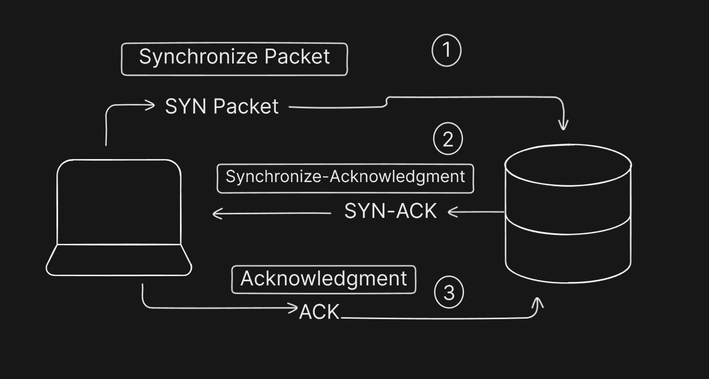
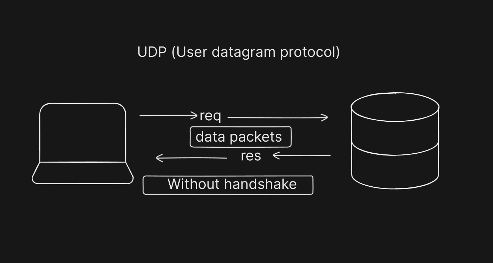

## Internet Protocol

### 1. What is TCP (Transmission Control Protocol) and why is it widely used?

- TCP is connection oriented protocol which is stablish between client and server for the reliable connection.
  It ensure that data packets correctly delivered or not , if any data packet failed to it will sent again. It create proper connection between sender and receiver.

### 2. How is Connection Established using TCP? (3-Way Handshake)

- To stablish the TCP connection there will be three steps `(3 Way Handshake)`.

1. SYN `( Synchronize)`: Sender send a `SYN` packet to start the connection.
2. SYN-ACK `(Synchronize-Acknowledgment)`: Receiver accept the `SYK packet` and send `SYN_ACK` for the confirmation.
3. ACK`(Acknowledgment)`: Sender send the `ACK` in the behalf of confirmation and then connection stablish.

### 3.  What is UDP `(User Data-gram Protocol)` and why is it used for fast communication?

It is connection less protocol which is used for fast communication. it is used where data loss is tolerable but need fast speed .

### 4.How Does UDP Establish Connection?

 There is no process to establish the connection. It directly sending and receiving the data packets without any handshake.

 