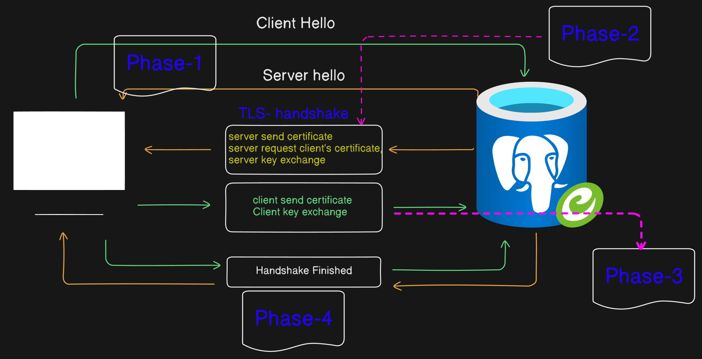
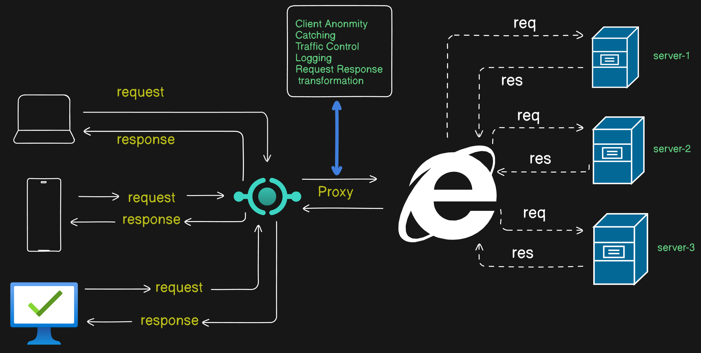
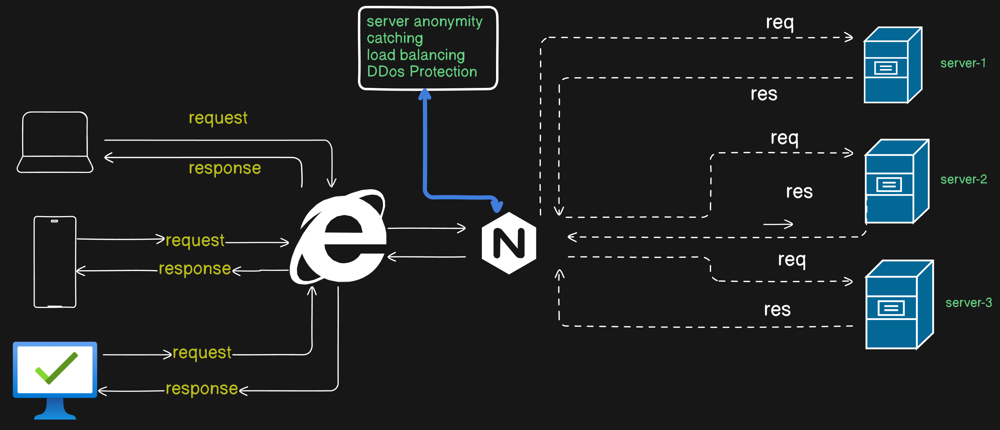

### 1. What is HTTP and its different version?

**HTTP (Hypertext transfer protocol)**:

- It is basically used to communicate between client and server.
- When we visit any website the website communicate with server by using http and then serve you the data packets.

**Version**

- **HTTP/ 0.9** : A simple one line protocol used to fetch `HTML` pages.

- **HTTP/ 1.0** : Introduced `metadata` (headers) now sending more information possible.

- **HTTP/ 1.1** : It become to handle multiple request at one connection.

- **HTTP/ 2** : It become capable to download multiple files at single connection.

- **HTTP/ 3** : It become more faster and secure because it uses ` QUIC (UDP)` not the old `TCP`

### 2. HTTP Status Code

**Every response has some result , to represent that it has some status code**

1. `1XX` (informational)

- 100 continue
- 101 switching protocol

2. `2xx` (success)

- 200 ok
- 201 created

3. `3xx` (redirection)

- 301 moved permanently
- 302 found

4. `4xx` (client error)

- 400 bad request
- 401 unauthorized
- 404 not found

5. `5xx` (server error)

- 500 internal server error
- 503 service unavailable

### 3. HTTPS and Its Advantages Over HTTP

1. `(Hypertext transfer protocol secure)`: It is HTTP with encryption `(secured using SSL/TLS)`

- It ensure that data is encrypted attackers can not read the data.
- Verifies the identity website via `ssl/tls` certificate.
- Prevents data alter during transmission.
- Improved the SEO `( Search Engine Optimization )`

### 4. How HTTPS provide secure connection.

- `TLS HandShake` Server send it's identity `TLS/SSL certificate` to client and request for client `identity`.

- Client sends its identity `(certificate)` and client key exchange. HandShake finished ...

### 5. `SSL ` ( Secure Sockets Layer) and `TLS ` (Transport Layer Security):

- These are the encryption protocol for safe data transfer.

### 6. `Proxy`:

- A proxy server act as a middle man between client and the internet. Instead of directly connecting to the website, it first got to the proxy server and then connect to the website.

* It block the content and Optimize the internet speed. Provide security and privacy`(hide the IP address)`.

### 7. `Reverse Proxy`:

- It is a proxy server that act as a middle man between the client and the server. Instead of directly request goes to the server it goes to the proxy server and then proxy server decide which server to request the data.

* It is also used to provide security and privacy to the server.
  It is also known as load balancer.

### 8. How does VPN work?

- VPN `(Virtual Private Network)` When we use VPN our internet traffic goes via a encrypted tunnel.
